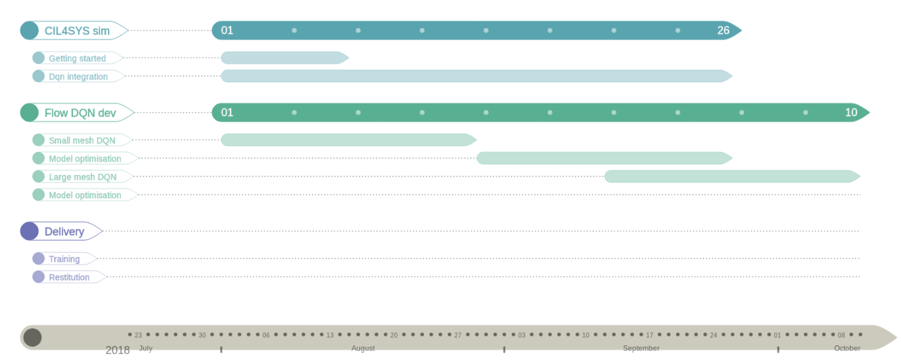
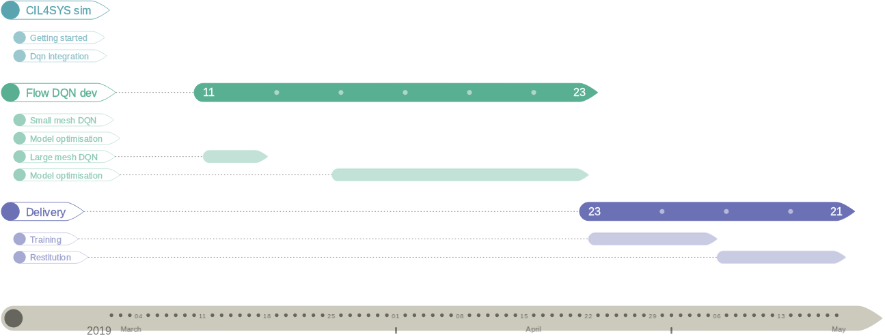

# Let's Get Startedd

---

## Add Some Slide Candy


---

## CIL4SYS

- Startup incubée à Telecom ParisTech
- Domain: simplification du cahiers des charges dans l'automobile

---

## Le projet

- Optimisation sous contraintes des flux de trafic routier en milieu urbain:
  - Pilotage des feux tricolores
  - Recommandations de vitesses aux voitures
  - Contraintes:
    - Temps de trajet max
    - Piétons
    - ...
- Intégration de notre algorithme à leur simulateur
- Les données de trafic de l'API TomTom nous ont été procurées.

---

## État de l'art

- De nombreux articles récents documentent les améliorations obtenues grâce à l'apprentissage pas renforcement.
- Ces articles utilisent en grande majorité le simulateur SUMO pour réaliser l'apprentissage.
- Un framework développé par des chercheurs de l'université de Berkeley, `Flow**, facilite l'apprentissage d'algorithmes avec Sumo.

---

## Notre solution

- Apprentissage par renforcement avec Flow et Sumo
- Pilotage des feux seulement dans un premier temps
- Ajout des recommandations de vitesse ensuite.

---

### Apprentissage par renforcement

#### Introduction

1. L'apprentissage par renforcement consiste a définir un espace d'action possible sur un environnement à chaque pas de temps. 
2. L'effet d'une action provoque un changement d'état du système. 
3. Une récompense est ensuite calculée.

**But:**  Maximiser la récompense
**Solution:** Réseau de neurones approchant la distribution des récompenses

---

#### Theoretical background


---

#### Reward function


---

#### SUMO: Simulation of Urban MObility


---

#### DQN on SUMO

---

## Planning 1/2



---

## Planning 1/2



---

## Testing new slide

#### The Cauchy-Schwarz Inequality

`\[
\left( \sum_{k=1}^n a_k b_k \right)^{\!\!2} \leq
 \left( \sum_{k=1}^n a_k^2 \right) \left( \sum_{k=1}^n b_k^2 \right)
\]`

#### Lispy hello world

``` lisp
(def foo (bar bat)
  (if (= bar bat)
      (message "hello world")
    (message "goodbey world")))

(foo (+ 1 2) 3) ; outputs "hello world"
```
